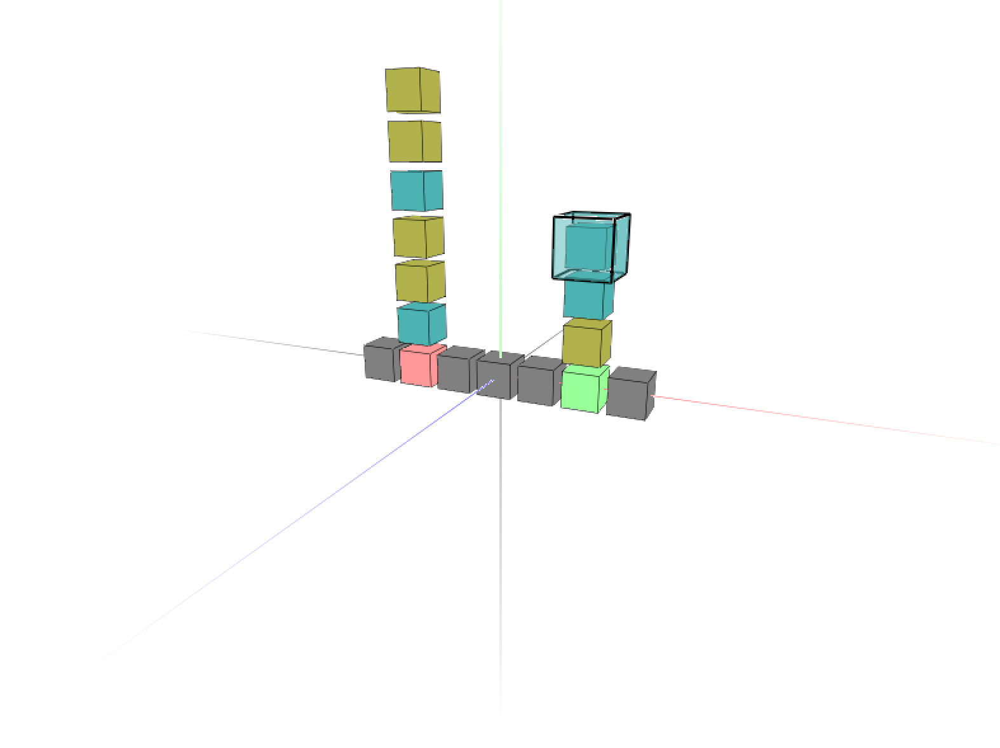

# turing3d

A 3d Turing machine simulator.

## Features

- Load external programs
- Assign any color to each state of the Turing machine
- Assign any color to each state of the 3d "tape"

## Screenshot

## Example program

[Busy beaver](https://en.wikipedia.org/wiki/Busy_beaver):

    [START_STATE]
    0

    [END_STATE]
    Halt

    [START_POS]
    (0 0 0)

    [DEFAULT_SYMBOL]
    0

    [RULES]
    0 0 = 1 1 (1 0 0)
    0 1 = 1 1 (-1 0 0)
    0 B = 1 1 (1 0 0)

    1 0 = 0 1 (-1 0 0)
    1 1 = 2 0 (-1 0 0)
    1 B = 0 1 (-1 0 0)

    2 0 = Halt 1 (0 1 0)
    2 1 = 3 1 (-1 0 0)
    2 B = 2 1 Halt

    3 0 = 3 1 (1 0 0)
    3 1 = 0 0 (1 0 0)
    3 B = 3 1 (1 0 0)

    [SYMBOL_COLORS]
    1 = (0.7 0.7 0.7)

    [STATE_COLORS]
    0 = (0.5 0.7 0.7)
    1 = (0.5 0.7 0.0)
    2 = (0.5 0.5 0.7)
    3 = (0.7 0.5 0.7)
    Halt = (1 0.3 0.3)
